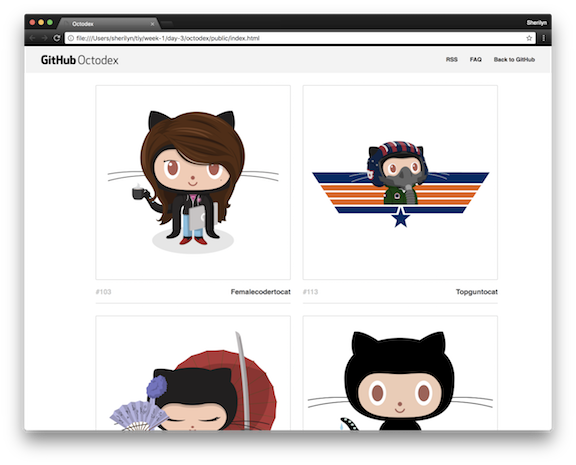
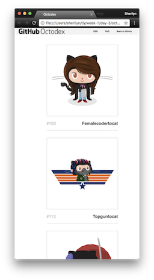

# Octodex

## Purpose of this project is to practice creating a website from scratch using flexboxes in HTML and CSS.

* The Github Octodex site was used as a visual inspiration for implementing a responsive design as closely to the original as possible.
* Still new to HTML and CSS, we were to try and get the fonts and sizes as close as possible

Here is the large screen version:

* As an added bonus, I tried to make the design responsive on smaller screens.

Here is the smaller screen version:

